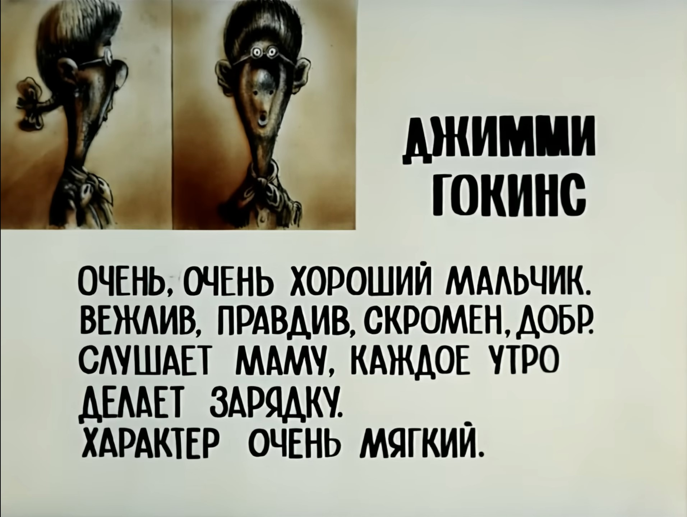

### **Как я** (но это неточно) **провёл** (бесконечное) **лето** (кстати, куда?)

>                                                        Success is the delusion of the soul!
>                                                                                    - Swedenborg

1. Ну, во-первых не Джимми и не Гокинс (или Хокинс? переводчики, хватить уже плодить анахроничный кринж в изданиях)
   
2. Потом, насчёт хорошести - это ещё весьма спорно. "Хороший" относительно кого - Джека Потрошителя или матери Терезы? Для чего "хороший"? В чём именно "хороший"? Или, может, "хороший" - это просто своего рода затычка, когда сказать чего-то бы надо, только идей нет, да и не очень-то хочется, вроде сакраментального "нормально" в ответ на "как дела"?
   
3. Вежлив - чушь, матерится через слово, бубнит под нос, обо всём высказывает своё особо ценное мнение когда ни попадя
   
4. Правдив - простите, но в 2k23 это уж совсем не вяжется с человеческими реалиями и граничит с аутизмом (разве что это такое проявление панковского кредо)
   
5. Скромность в трудоустройстве скорее вредна, чем полезна: светить физиогномикой надобно сколь возможно часто, ярко и нагло - глядишь, хоть кто-то тебя и заметит
   
6. Маму слушать - себя не уважать... вот то ли дело классная, которую соблазнил перед выпускным (хотя кто кого соблазнил, конечно, ну да ладно)
   
7. Про "утреннюю зарядку" лучше промолчим ради полудохлой попытки подпереть осыпающийся фасад соответствия общественным приличиям (незачем распространяться перед посторонними о гедонистических предпочтениях и специфике половой жизни)
   
8. Характер? Где вы его тут видите? Лишь отсутствие денег (а ещё лень и усталость от ярких эмоций) удерживает автора от симпования togatae с Твича
   
9.  Мягкий... пожалуй, да. Как хлеб. Пускай это будет хлеб. Цвет тот же. Плавучесть та же. XD

###### _8 (800) 555-35-35 — проще позвонить, чем зарплату получать! (с)_
